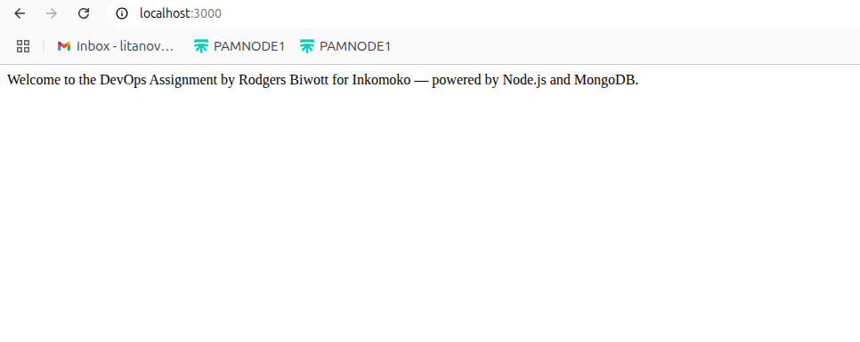

 ## DevOps Engineer Technical Assignment
This project demonstrates a scalable, secure, and automated infrastructure setup for a containerized Node.js + MongoDB application using Docker, Docker Compose, and DevOps best practices.

## Project Structure

├── app/                  # Node.js app
│   ├── index.js
│   ├── package.json
│   ├── .env
│   └── Dockerfile
├── docker-compose.yml    # Multi-container orchestration
├── terraform/            # Infra provisioning (EC2, SGs)
├── ansible/              # Config management (Docker, App setup)
├── nginx/                # Nginx reverse proxy config
├── monitoring/           # Prometheus/Grafana setup
└── .github/workflows/    # GitHub Actions CI/CD

# Application Stack

Component	   Description
Node.js	       Express-based web application
MongoDB	       Document database
Docker	       Containerization
Docker         Compose	Service orchestration
Terraform	   Infrastructure provisioning (EC2)
Ansible	       Configuration management
GitHub Actions	CI/CD Pipeline
Nginx	        Reverse Proxy + TLS
Prometheus	    Monitoring system metrics
Grafana	Metrics visualization dashboard

# How to Run Locally
1. Clone the repo

git clone https://github.com/yourname/devops-assignment.git
cd devops-assignment

2. Build and Start the Services

docker-compose up --build

3. Test the Application

curl http://localhost:3000

# Optional DB check
curl http://localhost:3000/ping-db
4. Stop the Services

docker-compose down

## CI/CD (GitHub Actions)
Triggered on main branch push

Runs tests, builds Docker image, SSH deploys to EC2 instance

Secrets Required:

SERVER_IP, SSH_KEY in GitHub repo settings

## Security Assumptions
Private key for SSH is secured via GitHub Secrets

MongoDB is only exposed internally via Docker network

In production, TLS via Let’s Encrypt + firewalled ports

## Monitoring (Optional)
Prometheus scrapes metrics (Node Exporter)

Grafana dashboard accessible at http://localhost:3001